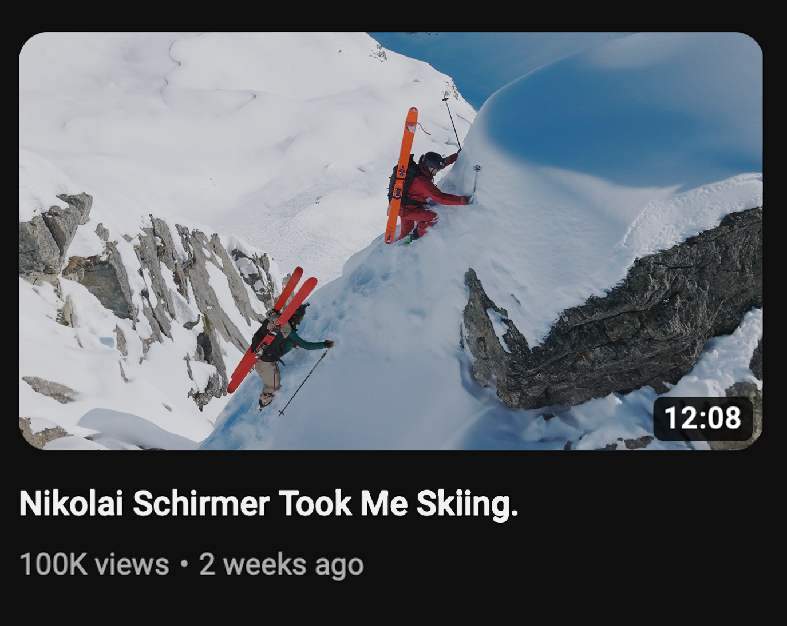
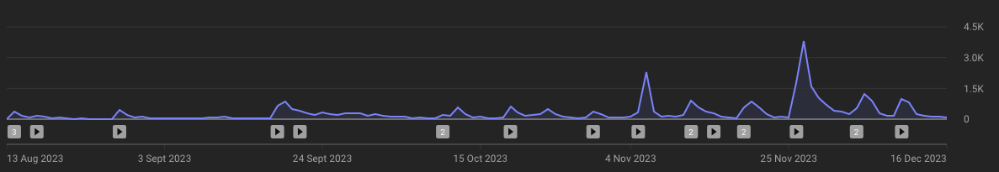
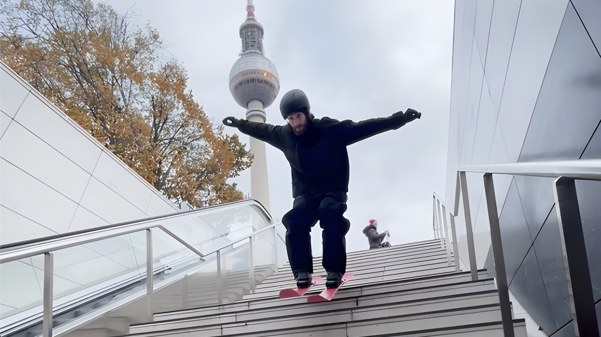
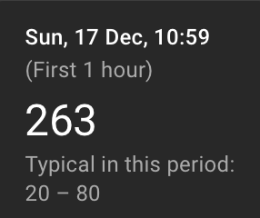
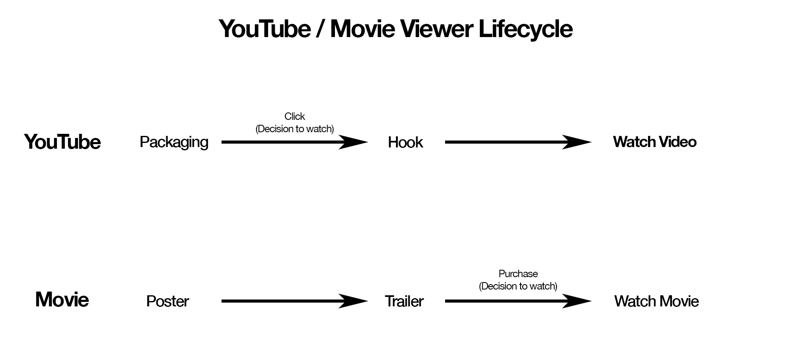
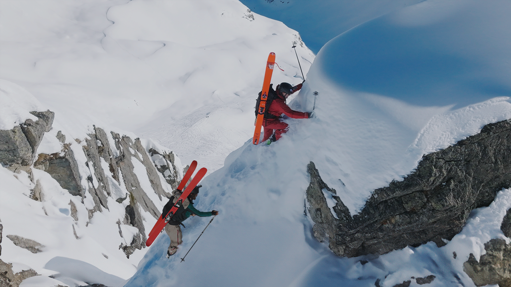
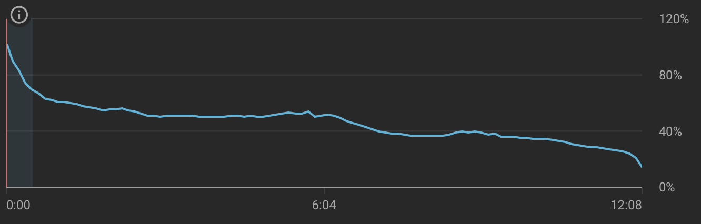
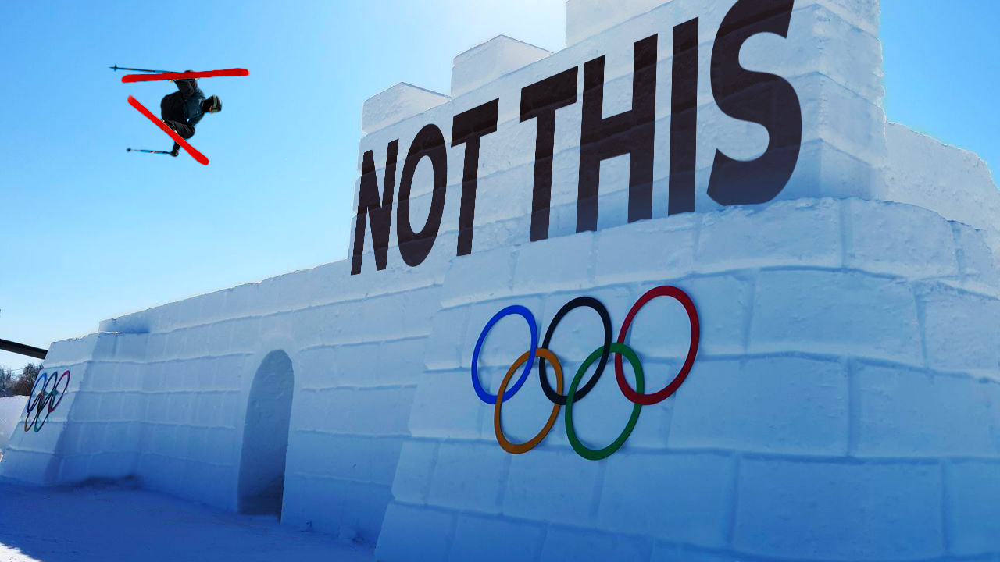

# Alex Hackel Case Study

How we helped take Alex Hackel in his first season on YouTube, go from struggling to make a thousand views, to averaging almost 50,000 views per video and gaining 100K views in 2 weeks on a single video.

TL:DR

**Background and Initial Performance**

- Alex Hackel, an accomplished skier, started his YouTube channel in August 2023, initially struggling with views ranging from 103 to 9,283 in the first 3 weeks
- Early videos lacked sustained viewership, indicating issues with content appeal to new viewers

**Strategy and Improvements**

- Focus shifted to improving storytelling skills rather than aiming for viral content
- Collaboration began with packaging videos, then expanded to editing feedback and idea generation
- Breakthrough came with "Olympian Teaches Me How To Carve" video, emphasising improved idea, execution and intro

**Key Successes**

- "Nikolai Schrimer Took Me Skiing" video reached 140K views, leveraging collaboration with an established ski YouTuber
- "The Event That Is Redefining Ski Culture" video about JibLeague garnered 47K views, using strategic packaging to appeal to casual viewers

**Results**

- Alex's channel progressed from struggling to reach 1,000 views to averaging nearly 50,000 views per video

## How did we achieve this?

let me explain.

# Who is Alex?

Alex Hackel is an accomplished street, freestyle, and freeride skier with two X Games medals to his name. He has starred in multiple award-winning films with the renowned ski collective The Bunch. Alex has also established a significant social media presence, with his Instagram and TikTok accounts experiencing rapid growth. Notably, he gained over 100,000 new Instagram followers this past season, demonstrating his rising popularity in the skiing community.

# Starting Performance

Alex started posting mid August, with a podcast with Magnus Graner (another Bunch Skier) and his first vlog on 17th August 2023. He posted a range of content leading into the season. Including:

- Vlogs
- Podcasts
- Podcast Clips
- Reaction Videos
- Interviews

The views on these videos ranged from 103 to 9283 for the first 3 weeks of publishing. With a median and average view count of 867 and 1545 views respectively. For consistency I will only be looking at video performance over the first 3 weeks. These videos keep getting views as the season goes on. We want to try and isolate as many variables as possible, however as you’ll see later on previous video performance can still have an effect on performance. This means that posting wildly different styles of content generally isn’t a good idea. Especially when you are starting a YouTube Channel.

You can see from the total daily views that all the videos have a strong peak on the day after release but the overall they don’t sustain views. This is generally an indication that one of the big three - idea, packaging and execution - or a combination of them aren’t at a level that is appealing to new viewers. New viewers being people that don’t already watch your content on YouTube. If they are aware of you or watch content on your other platforms we still classify them as a new viewer.

# Getting Involved

Looking for new clients, I knew Alex had started posting videos on YouTube but I hadn’t watched any of them.

When watching his most recent video at the time - [‘Giving out $1000 to Skiers!!!’](https://youtu.be/ZBnZLyGI_cw).

I saw potential from the effort and thought being put into the video, how it was packaged and there were a few great moments in the video that really stood out to me. However I felt like there wasn’t a clear vision or overarching story and it was just moments from the day stuck together. Alex and Casey (Editor) were clearly trying to make YouTube work but were unsure of what to post on YouTube.

I contacted Alex providing my [YouTube Fundamentals for Skiers](https://www.notion.so/YouTube-Fundamentals-for-Skiers-2d8579f6ba254735bc05a5adf292ad1b?pvs=21) which he found it useful and wanted to know more so we arranged a chat. There Alex told me about his vision for what he wanted his YouTube channel to become. He also expressed that he wanted to blow it up as quickly as possible.

I advised against this, as virality with out any consistency, doesn’t create a sustainable business. A long term committed audience takes time to build on any social media platform. Instead I recommended that the main focus was to get better at storytelling. If you get good at this, it is very unlikely for you to fail in the long term.

Alex told me he particularly had a lot of trouble trying to come up with the packaging of the videos. So we agreed that I would start helping with just that and if Alex found my help useful, we would move onto other areas that I could support in.

# First Video

The first video I worked on was [‘I Went Skiing in Berlin’](https://youtu.be/TjO-aQqlDVM). It is a behind the scenes look of a campaign photoshoot that Alex did for Peak Performance for a new store that was opening in Berlin. The video had already been filmed and partially edited. I created the packaging from a frame of an iPhone clip. I think the thumbnail is solid.

You can clearly see Alex skiing down stairs and the Fernsehturm tower in the background which is an icon part of Berlin’s skyline.

The Initial performance was very good, better than his previous videos and the first hour performance was on par with some of the more recent videos that have over 10x the views

This early momentum wasn’t sustained. This tells that the packaging likely isn’t the issue and the video is more of the problem. Alex’s core audience were interested in watching the video but as the video got put out to a wider audience, they didn’t watch enough of the video. The algorithm’s signal is that only a very specific type of audience is enjoying this video and so the impressions slow down.

By comparison to the previous videos that Alex had uploaded it was still an improvement overall as the three week views would place it second.

YouTube is hard, there are a lot of skills needed to make successful videos. By focusing on a one area at a time, we can be sure that we are making meaningful progress. Like all learning this can take time, luckily with Alex, he has a lot of experience making videos. So he only had a few areas to work on with to see progress. With the next couple of releases I started to help in other areas, such as providing feedback on the editing and idea generation. However the next couple videos released performed similar and the fourth one was where the combined improvements came into play and we had a breakthrough.

# Breakthrough

Up until now, I had only spoken Alex. [Casey](https://www.instagram.com/ceagull/), the man behind the scenes, the master editor and I finally got the time to speak over the phone. This chat helped us clarify the vision, I encouraged him to take more creative editing choices and to focus on avoiding ‘and then’ story telling, which had been used a lot in previous videos (dedicated blog post on this to come). As such the first video we released after this also had a couple significant improvements that make a night and day improvement.

## Olympian Teaches Me How To Carve

Released 7th Jan 2024 - 137k Views (20th Oct)

These improvements are the idea and the intro.

Alex had arranged to meet up with his friend Hedvig Wessel, and go skiing for the day. They ended up teaching each other different techniques (Alex teaching freestyle and Hedvig carving). Although Hedvig is not the most famous skier, being an Olympian allows a wider audience to understand her ability quickly. With these two factors the packaging became obvious. The filmer also had a good eye for thumbnails and provided some great photos of them both carving in the same spot.

With the packaging decided, we moved onto creating and intro from the video. With this we want to affirm that the video the viewer clicked on is the one they are getting. So we start by showing a couple of clips of Alex learning to carve, then we validate Hedvig by explaining a little bit about her with some clips from the Olympics and FWT.

Why is this important?

This is important to do as with YouTube there is very low friction to watching a new video. A hook in this format would be a very odd story telling technique to use in traditional media. The simplest way to think about it, is that your thumbnail is like the movie poster that is seen first, you’ve made a trailer (hook) and played it before the video.

## Nikolai Schrimer Took Me Skiing

Released 22 Jan 2024 - 140K Views (20th Oct)

What’s different about this video?

The first thing you’ll notice about this video is that we use another skiers name as the interest for video rather than their accomplishments. The reason for this, if you don’t know Nikolai, is that he is already an accomplished Ski YouTuber with over 162K subs, and 17M views.

Knowing Nikolai has a strong following already and a certain style to his videos, we kept this in mind with how we structure the video. Keeping it similar to Nikolai but with having an Alex spin and voice.

We also put a lot of work making sure the hook was incredibly tight with every frame accounted for. This lead to our most successful video of the season, but even from your successes it is still important to see what more you can learn.

We learnt that we need to make sure to rehook the viewer, especially as payoff for the intro hook is hallway through the video. We didn’t provide a new hook to keep the viewer engaged. This can be seen in the retention graph, where we have a bump and a consistent drop off after this payoff.

## The Event That Is Redefining Ski Culture

Released 17th April 2024 - 47K Views (20th Oct)

This video is about JibLeague, an alternative competition series that was started by three professional free skiers. We also knew that an official documentary was dropping, showing the process of setting up JibLeague from the beginning. So we waited for the angle that they presented, for both some inspiration but also to make sure we weren’t telling the same story. We decided to focus on explaining the event but also having a first hand take on what it is like to compete.

One of the main challenges we had with this video is that for people who follow skiing casually have probably never heard of JibLeague or know about it’s story and what makes it significant.

As a lot of people are aware of the olympics and traditional competitions, we decided to invert the packaging and relate it to those instead. We knew that we wanted to give background on the sports progression for casual viewers as this is important context. But with the packaging that we have, we decided to explicitly start with a shot of a trick from the olympics, to give that visual confirmation when you clicked on the video. It also doubles to show a strong contrast with where the sport is at and where it was 20 years ago.

> "Robbie is fantastic to work with. Not only does he have a great understanding of YouTube with knowledge in packaging, ideation, and video editing, he also is driven, passionate, and easy to work with. He has been instrumental in my growth on YouTube, and I believe that he will make a huge impact for any creator or brand looking to grow their YouTube presence." - Alex Hackel

# Conclusion

In just a few months, Alex Hackel went from struggling to reach 1,000 views to becoming a growing force on YouTube, consistently hitting nearly 50,000 views per video. This growth didn’t happen overnight—it was the result of intentional focus on improving storytelling, refining packaging, and honing video execution.

Alex’s journey shows that success on YouTube doesn’t rely on a single viral moment but on continually improving the core elements of content creation. Through careful planning, a clear vision, and a lot of hard work, he built a sustainable presence that’s well-positioned to grow even further.
