# YouTube Fundamentals for Skiers

# Intro

Hi I’m Robbie AKA The Flying Englishman, I’ve been watching YouTube for the past 15 years, I’ve dabbled in making videos for a variety of different niches and spent the last two years making snowsports related videos. These snowsport videos have been watched over 2 million times. I wanted to quickly outline a generic approach that I have developed on how I think about the videos I make with some specific snowsports examples.

When thinking about the fundamentals to creating a successful video or channel on YouTube the best place to start is asking what does YouTube want?

Really there are only three things.

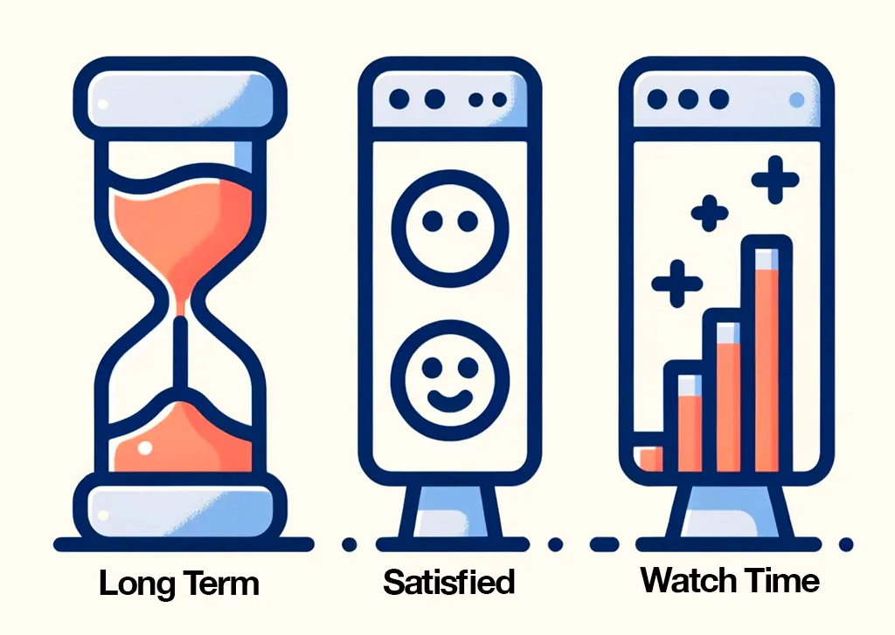

Long term being that user’s come back time and time to watch content on the platform. Satisfied being that people find the videos enjoyable and get value from the content. Watch time being that people watch the videos that they choose the whole way through. YouTube want viewers to stay on the platform while making sure that they are satisfied with the experience so they want to come back. So how does YouTube accomplish this?

# The Algorithm

The Algorithm is the name we have for the YouTube recommendation system. In reality there are multiple algorithms, for example the homepage and sidebar have different algorithms with different goals.

What are these goals?

Well they are there to serve the content to the viewer that meets YouTubes three fundamental criteria. How is content served? With a title and thumbnail decided on by the creator. On the YouTube homepage it will look something like this:

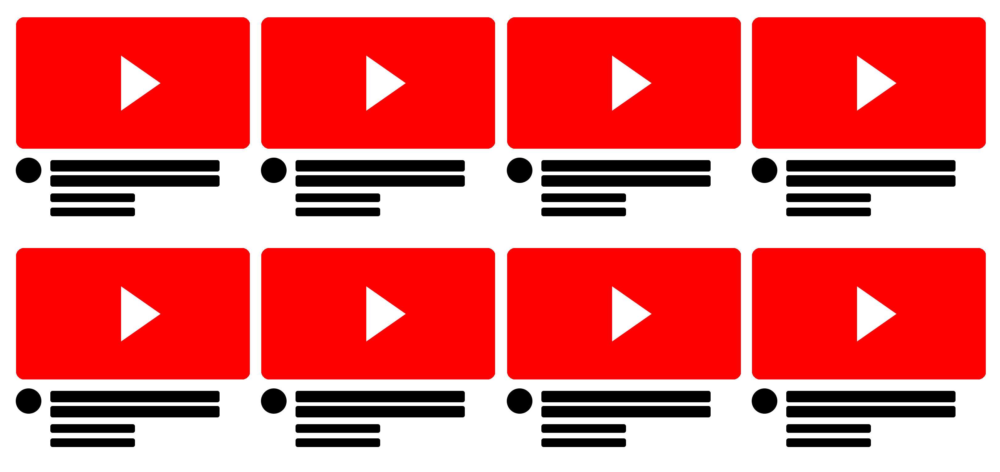

The viewer is presented with 8 videos that the algorithm thinks they might be interested in to watch.

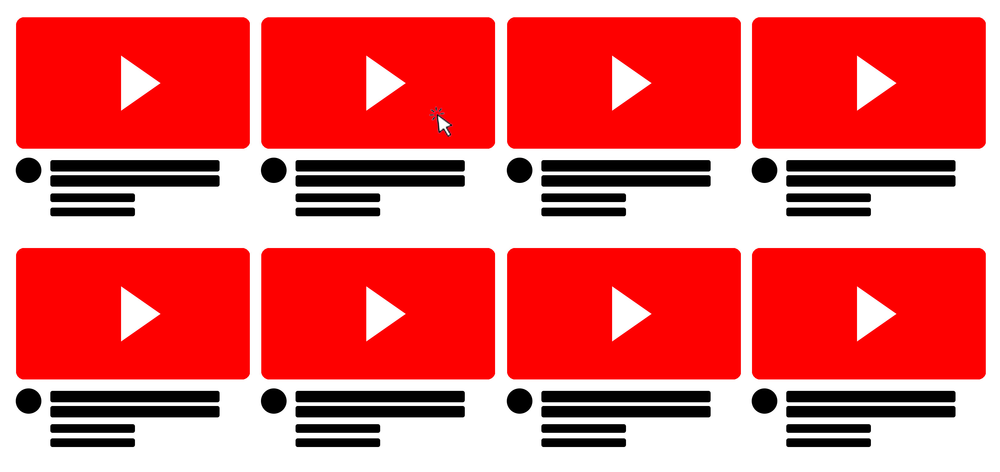

If the viewer selects one these videos we are left with one video that won the attention of the viewer and 7 losers.

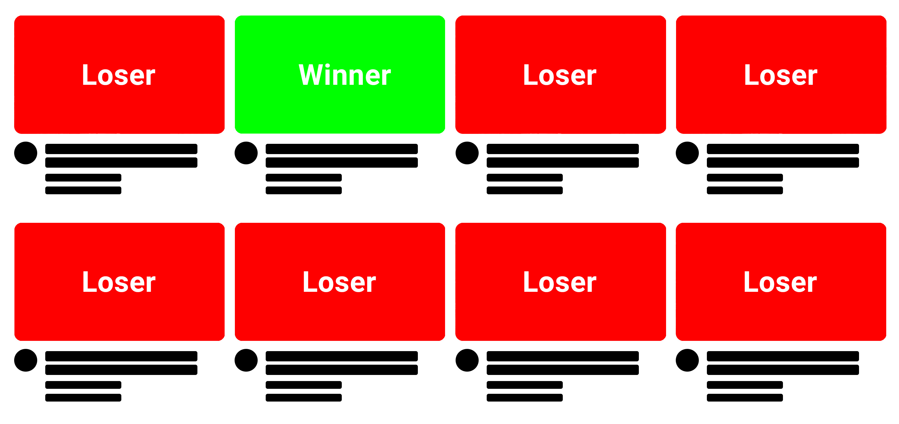

# Game of Attention

As a creator YouTube is a Game of Attention. There are two parts to this game. Interest and Delivery.

The idea for your video dictates who is going to be interested. Most viewers that come onto the platform won’t be interested in skiing. Lets say you want to create videos on teaching people how to ski. You are only going to get the attention of viewers that want to watch video teaching them

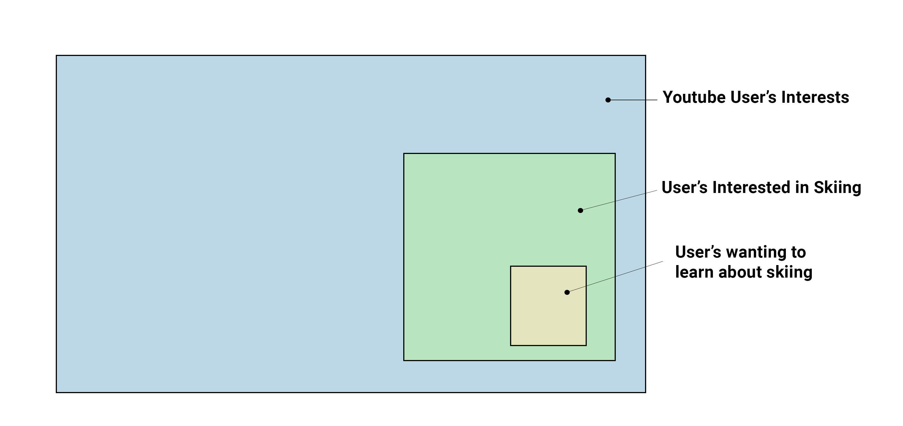

How well you execute on your idea and deliver value to the viewer is going to dictate how many viewers will see and then watch the content.

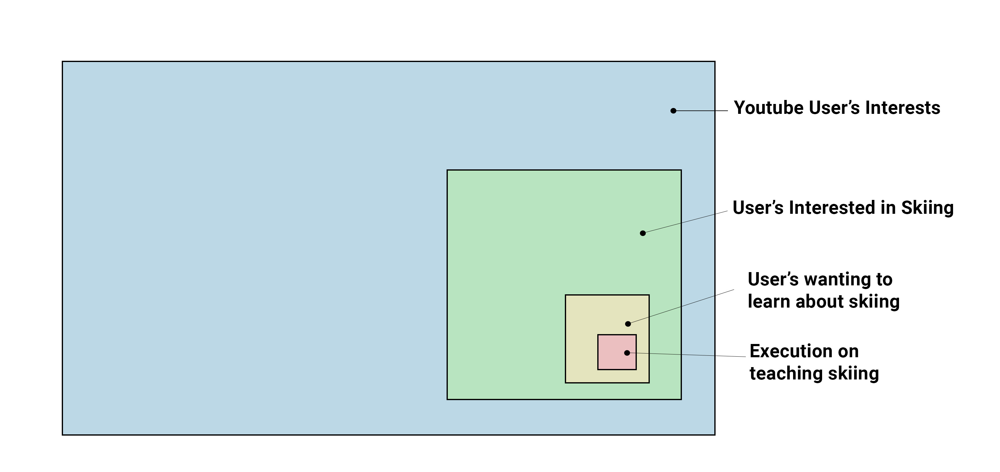

Now that we know our viewership potential is limited by the idea of our video, the next question that is raised, is how do you execute well?

### Simply Make Great Videos

There are many many many different ways videos can be great - going over this is out of the scope is for this post.

But don’t under-allocate time on the click.

# Packaging

The title and thumbnail is what grabs a viewers attention. We typically refer to the title and thumbnail as the packaging

I just want to quickly note that a good idea doesn’t mean good packaging, it’s possible to have good ideas that are hard to package well. To maximise the possible views on a video you need to have a good idea, good execution on that idea and good packaging.

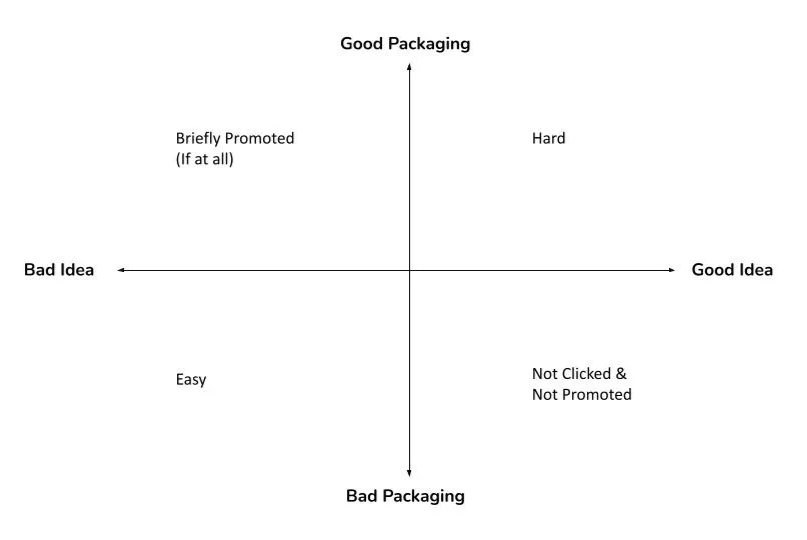

It’s also important to consider when viewers are thinking about skiing as this heavily affects content performance. This graph shows performance of videos that I’ve seen over every ski/snowboard related channel that I’ve worked on.

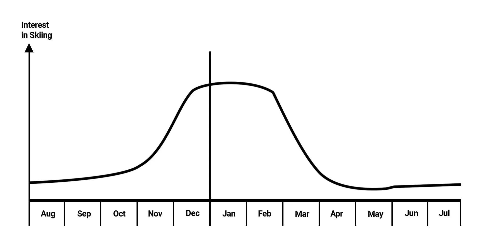

The majority of views will come during the end of December through to the end of February. Which is when the majority of people take part in the sports. This seasonality of interest affects how the YouTube algorithm will present the content and this means that this period is the most important for seeing how well your content will perform. Content performance during summer months is not a good indication of how good your content is.

# Packaging Examples

Doubling down on the importance of the click here are two different examples of packaging for the exact same video posted on two different channels. The video is a skier noticing a snowboarder stuck in a tree well and recusing him. The video was posted on two different news channels 4 days apart. Which video do you think performed better?

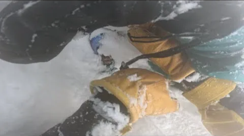

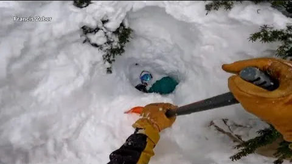

The thumbnail on the left you can see three gloves and kind of a face sticking out - but it takes time to actually see whats going on. The thumbnail on the right is immediately obvious what is happening. You can clearly see the point of view of a guy using a shovel to dig out a person stuck at the bottom of the hole. Outside of the title differences, the right video is very clear on what the content is.

As of the beginning of November 2023 the video on the left had almost 30 thousand views. Which isn’t terrible. But to put that in perspective, the video on the right had 13.8 million views. That’s over 500 times more views. And remember the video’s are exactly the same.

The algorithm is pretty smart, just because the title and thumbnail doesn’t work out as well on the first time doesn’t mean the video is doomed. This video how to ride in alignment was posted by Snowboard Addiction back at the beginning of October 2018.

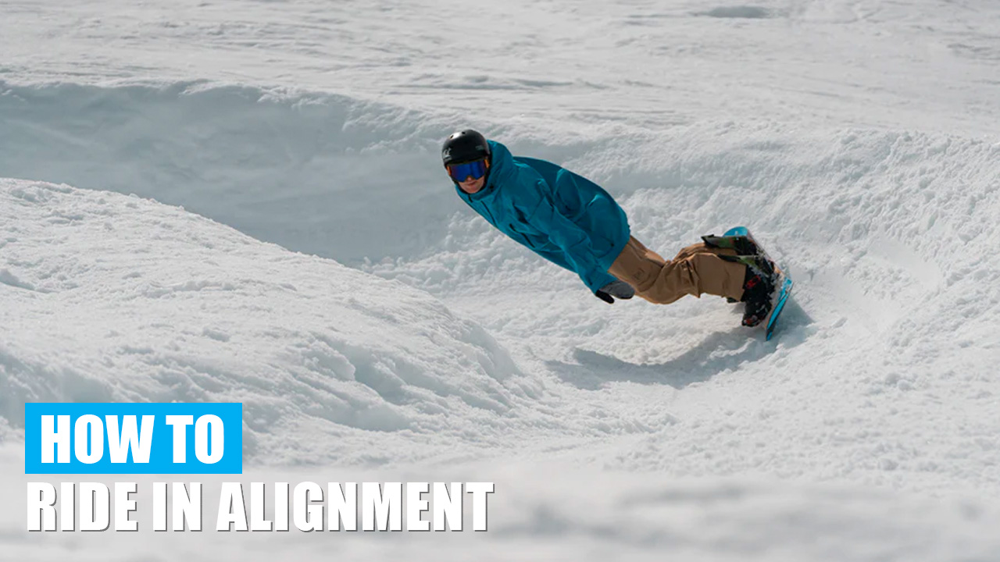

It’s a great video showing a strong riding position that everyone should know. But the trouble is that the term riding in alignment is understood by the people who already know about it and do it. But if you don’t know what it means it isn’t obvious why the way you’re snowboarding is bad. The video still gained 500,000 views over the first three seasons. Showing us that the quality of the video was still high. The views were a lot slower during the fourth season. In February I changed the title and thumbnail.

This graph shows the top performing video views on Snowboard Addiction during that season. The red line is the performance of the video in question.

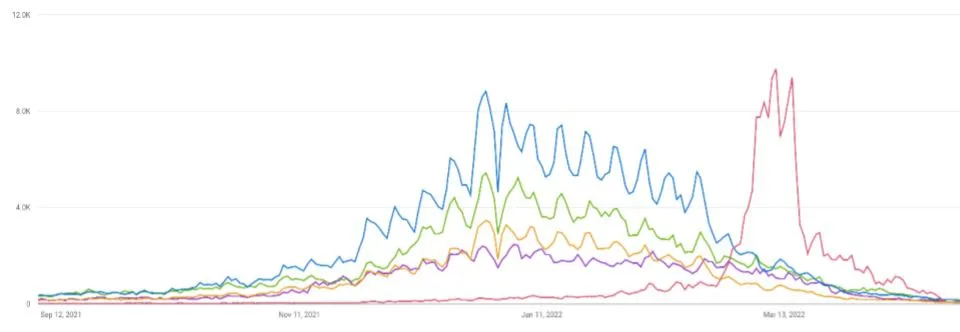

And this is when I updated the thumbnail and title, you can see how much of a difference the new title and thumbnail made. Here is what I updated it to.

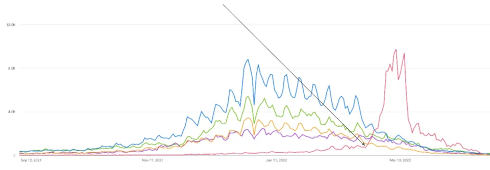

### Fix the Most Common Snowboarding Mistake

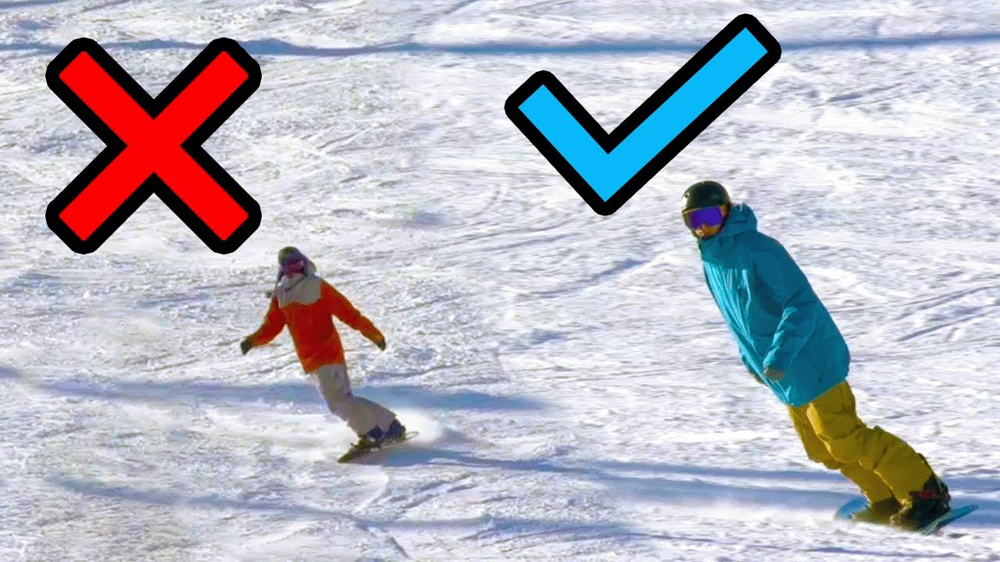

We can clearly see the difference in stance between the rider on the left to the rider on the right who is in alignment. I changed title to Fix The Most Common Snowboarding Mistake as you see a lot of intermediate level snowboarders not riding in alignment which is typically the biggest reason stopping them from becoming a better rider. The cross and the tick are to show in a glance which position is what you are after. The results of the change speak for themselves. In the year and a half since I changed the packaging the video has done and additional 1.3 million views, bringing the total up to 1.8 million.

# Summary

YouTube is about serving the audience and to do that we need to Make the Best Videos possible and earn the click. There is a lot more nuance to making great videos than I can cover in a short recorded presentation.
