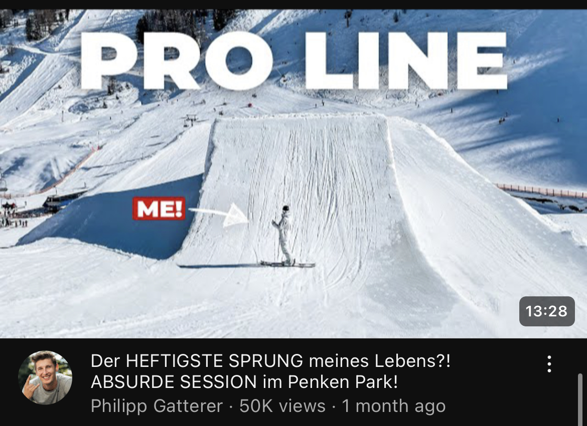
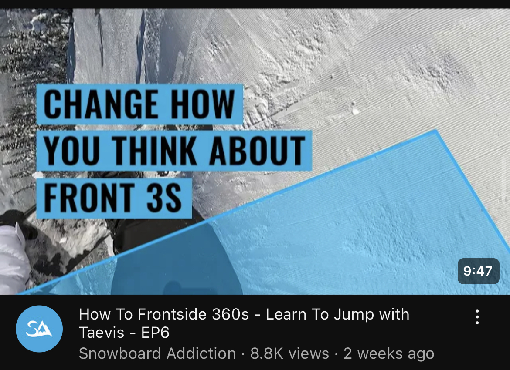
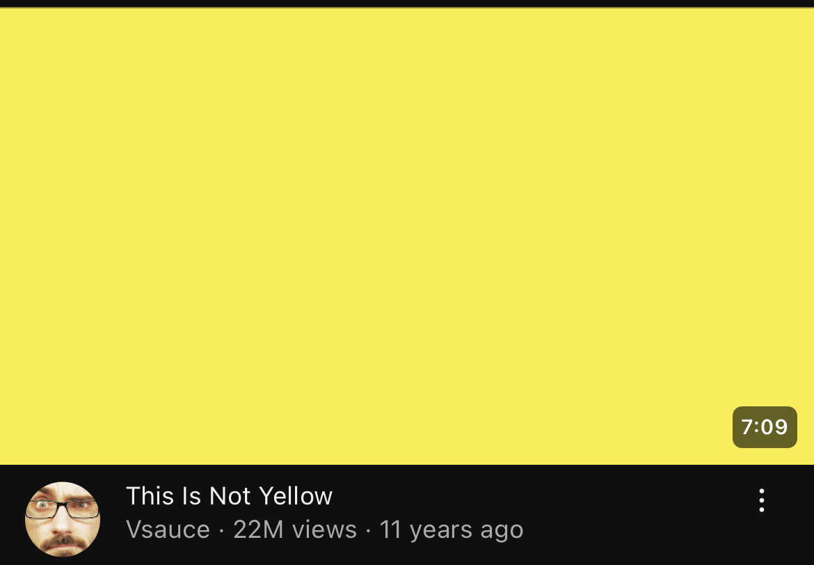

# Week 1 - Thumbnail Simplicity

Every week I’m going to post a small insight into YouTube.

The first one is going to be on the most common mistake I see with thumbnails. I see a lot of people trying to put as many things in their thumbnail as possible, using arrows or text to point out the main element or not having a clear focus. A general rule of thumb I like to keep is being able to understand the thumbnail at a glance.

Here are a few bad examples of busy - not so quick to understand examples

A simple outfit change so that Philipp doesn’t blend into the jump would go a long way

Same person twice, positing effects, and text that repeats the title. The idea and the execution of the video does a lot of the heavy lifting for the views, but having a simple understandable thumbnail to go along with it would help.

This took me about 10-15 seconds to figure out what even was going on here. This should take less than 0.5s to understand.

Here is a great example:

Visually very interesting. Two elements very clear to understand - fake snow and a snowboarder. the title ads a lot of curiosity. I’ll do a deeper breakdown on this video in the future

And here is my favourite example of a simple thumbnail:

I don’t think this needs any explanation

Generally - Less is more when it comes to thumbnails. I always ask myself ‘Can I have less elements?’, ‘Are my eyes draw to the most important part?’ and ‘Will a casual view/skier/snowboarder understand it at a glance?’
